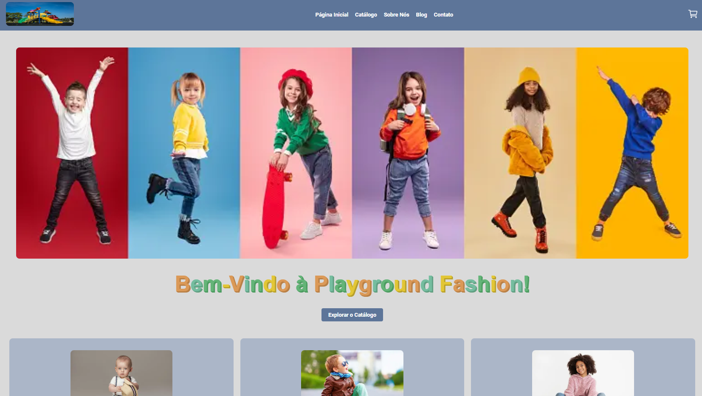

# Projeto Vem Ser Tech - Ada/iFood - Exercício 5 - Trabalhando com Tags Semânticas

→ Construir uma página semântica e super acessível utilizando os conceitos aprendidos na aula.

## Primeiro escolha um tipo de pagina: (as cores são sugestão)

- Loja de doces → [Cores](https://colorhunt.co/palette/ffc7c7ffe2e2f6f6f68785a2)
- Fabrica de software → [Cores](https://colorhunt.co/palette/f9f7f7dbe2ef3f72af112d4e)
- Loja de roupa infantil → [Cores](https://colorhunt.co/palette/f38181fce38aeaffd095e1d3)
- Blog de Jeepeiros -> [Cores](https://colorhunt.co/palette/7d5a50b4846ce5b299fcdec0)

Requisitos:

Cada página deve ter um menu com 3 itens: (cada um sera um arquivo html separado)

- Home
- Sobre
- Catálogo (produtos, posts, etc…)

Utilize os layouts a seguir para construir as páginas:

